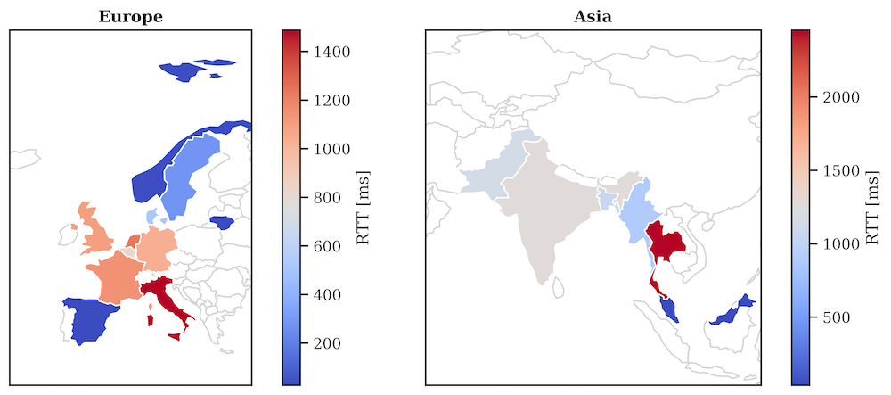

# Login Data Set for Risk-Based Authentication

> Synthesized login feature data of >33M login attempts and >3.3M users
> on a large-scale online service in Norway. Original data collected
> between February 2020 and February 2021.

This data sets aims to foster research and development for
[Risk-Based Authentication (RBA)] systems. The data was synthesized from
the real-world login behavior of more than 3.3M users at a large-scale
single sign-on (SSO) online service in Norway.

The users used this SSO to access sensitive data provided by the online
service, e.g., a cloud storage and billing information. We used this
data set to study how the [Freeman et al. (2016)] RBA model behaves on a
large-scale online service in the real world (see [Publication](#publication)). The
synthesized data set can reproduce these results made on the original
data set (see [Study Reproduction](#study-reproduction)). Beyond that, you can use this data
set to evaluate and improve RBA algorithms under real-world conditions.

**WARNING:** The feature values are plausible, but still **totally**
**artificial**. Therefore, you should NOT use this data set in
productive systems, e.g., intrusion detection systems.

## Table of Contents

<!-- TOC depthFrom:2 depthTo:6 withLinks:1 updateOnSave:1 orderedList:0 -->

- [Table of Contents](#table-of-contents)
- [Download](#download)
- [Overview](#overview)
- [Data Creation](#data-creation)
	- [Regarding the Data Values](#regarding-the-data-values)
- [Study Reproduction](#study-reproduction)
- [Ethics](#ethics)
- [Publication](#publication)
		- [Bibtex](#bibtex)
- [License](#license)

<!-- /TOC -->

## Download

You can download the data set under the [Releases](https://github.com/das-group/rba-dataset/releases) section of this GitHub project.

## Overview

The data set contains the following features related to each login
attempt on the SSO:

Feature                    | Data Type | Description                                                                                      | Range or Example
---------------------------|-----------|--------------------------------------------------------------------------------------------------|------------------------------------------------------
IP Address                 | String    | IP address belonging to the login attempt                                                        | 0.0.0.0 - 255.255.255.255
Country                    | String    | Country derived from the IP address                                                              | US
Region                     | String    | Region derived from the IP address                                                               | New York
City                       | String    | City derived from the IP address                                                                 | Rochester
ASN                        | Integer   | Autonomous system number derived from the IP address                                             | 0 - 600000
User Agent String          | String    | User agent string submitted by the client                                                        | Mozilla/5.0 (Windows NT 10.0; Win64; \...
OS Name and Version        | String    | Operating system name and version derived from the user agent string                             | Windows 10
Browser Name and Version   | String    | Browser name and version derived from the user agent string                                      | Chrome 70.0.3538
Device Type                | String    | Device type derived from the user agent string                                                   | (`mobile`, `desktop`, `tablet`, `bot`, `unknown`)[^1]
User ID                    | Integer   | Idenfication number related to the affected user account                                         | [Random pseudonym]
Login Timestamp            | Integer   | Timestamp related to the login attempt                                                           | [64 Bit timestamp]
Round-Trip Time (RTT) [ms] | Integer   | Server-side measured latency between client and server                                           | 1 - 8600000
Login Successful           | Boolean   | `True`: Login was successful, `False`: Login failed                                              | (`true`, `false`)
Is Attack IP               | Boolean   | IP address was found in known attacker data set                                                  | (`true`, `false`)
Is Account Takeover        | Boolean   | Login attempt was identified as account takeover by incident response team of the online service | (`true`, `false`)

[^1]: Few (invalid) user agents strings from the original data set could not be parsed, so their device type is empty. Perhaps this parse error is useful information for your studies, so we kept these 1526 entries.

## Data Creation

As the data set targets RBA systems, especially the [Freeman et al.
(2016)] model, the statistical feature probabilities between all users,
globally and locally, are identical for the categorical data. All the
other data was randomly generated while maintaining logical relations
and timely order between the features.

The timestamps, however, are not identical and contain randomness. The
feature values related to IP address and user agent string were randomly
generated by publicly available data, so they were very likely not
present in the real data set. The RTTs resemble real values but were
randomly assigned among users per geolocation. Therefore, the RTT
entries were probably in other positions in the original data set.

- The country was randomly assigned per unique feature value. Based on
  that, we randomly assigned an ASN related to the country, and
  generated the IP addresses for this ASN. The cities and regions were
  derived from the generated IP addresses for privacy reasons and do not
  reflect the real logical relations from the original data set.

- The device types are identical to the real data set. Based on that, we
  randomly assigned the OS, and based on the OS the browser information.
  From this information, we randomly generated the user agent string.
  Therefore, all the logical relations regarding the user agent are
  identical as in the real data set.

- The RTT was randomly drawn from the login success status and
  synthesized geolocation data. We did this to ensure that the RTTs are
  realistic ones.

### Regarding the Data Values

Due to unresolvable conflicts during the data creation, we had to assign
some unrealistic IP addresses and ASNs that are not present in the real
world. Nevertheless, these do not have any effects on the risk scores
generated by the [Freeman et al. (2016)] model.

You can recognize them by the following values:

- ASNs with values >= 500.000

- IP addresses in the range 10.0.0.0 - 10.255.255.255 (10.0.0.0/8 CIDR
  range)

## Study Reproduction

Based on our evaluation, this data set can reproduce our study results
regarding the RBA behavior of an RBA model using the IP address (IP
address, country, and ASN) and user agent string (Full string, OS name
and version, browser name and version, device type) as features.

The calculated RTT significances for countries and regions inside Norway
are not identical using this data set, but have similar tendencies. The
same is true for the Median RTTs per country. This is due to the fact
that the available number of entries per country, region, and city
changed with the data creation procedure. However, the RTTs still
reflect the real-world distributions of different geolocations by city.

See [RESULTS.md](RESULTS.md) for more details.

## Ethics

By using the SSO service, the users agreed in the data collection and
evaluation for research purposes. For study reproduction and fostering
RBA research, we agreed with the data owner to create a synthesized data
set that does not allow re-identification of customers.

The synthesized data set does not contain any sensitive data values, as
the IP addresses, browser identifiers, login timestamps, and RTTs were
randomly generated and assigned.

## Publication

You can find more details on our conducted study in the following
journal article:

[Pump Up Password Security! Evaluating and Enhancing Risk-Based Authentication on a Real-World Large-Scale Online Service] (2022) 
_Stephan Wiefling, Paul René Jørgensen, Sigurd Thunem, and Luigi Lo Iacono_. 
_ACM Transactions on Privacy and Security_

#### Bibtex

~~~.bibtex
@article{Wiefling_Pump_2022,
  author = {Wiefling, Stephan and Jørgensen, Paul René and Thunem, Sigurd and Lo Iacono, Luigi},
  title  = {Pump {Up} {Password} {Security}! {Evaluating} and {Enhancing} {Risk}-{Based} {Authentication} on a {Real}-{World} {Large}-{Scale} {Online} {Service}},
  journal = {{ACM} {Transactions} on {Privacy} and {Security}},
  doi = {10.1145/3546069},
  publisher = {ACM},
  year   = {2022}
}
~~~

## License

This data set and the contents of this repository are licensed under the
[Creative Commons Attribution 4.0 International (CC BY 4.0)] license.
See the [LICENSE](LICENSE) file for details.  If the data set is used
within a publication, the following journal article has to be cited as
the source of the data set:

Stephan Wiefling, Paul René Jørgensen, Sigurd Thunem, and Luigi Lo
Iacono: Pump Up Password Security! Evaluating and Enhancing Risk-Based
Authentication on a Real-World Large-Scale Online Service. In: ACM
Transactions on Privacy and Security (2022). doi: [10.1145/3546069](https://doi.org/10.1145/3546069)

[Pump Up Password Security! Evaluating and Enhancing Risk-Based Authentication on a Real-World Large-Scale Online Service]: https://doi.org/10.1145/3546069
[Risk-Based Authentication (RBA)]: https://riskbasedauthentication.org
[Freeman et al. (2016)]: https://doi.org/10.14722/ndss.2016.23240
[Creative Commons Attribution 4.0 International (CC BY 4.0)]: https://creativecommons.org/licenses/by/4.0/