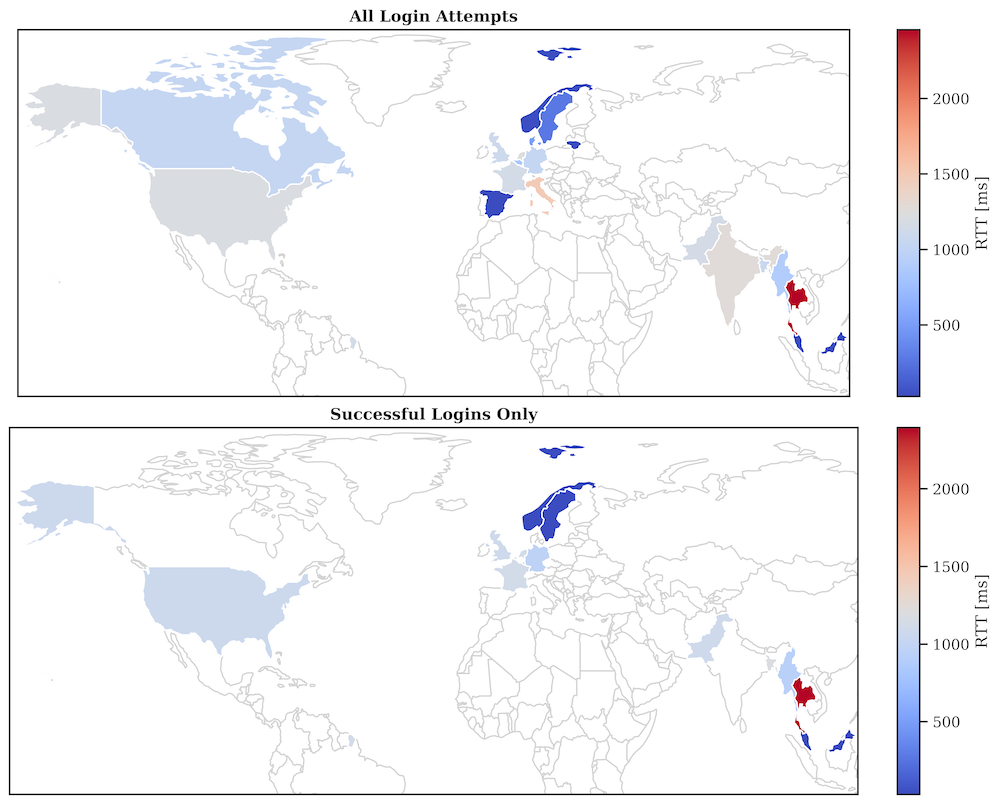

# Reproduced Results Using This Data Set

## RBA Behavior

Median re-authentication counts and rates for the different attacker types:

Median re-authentication rates for the different attacker types and login frequencies:

Median re-authentication rates when including attack data:

_Note: Slight differences to the original results are possible, as the
randomly selected values in the stratification process might differ._

## Round-Trip Time (RTT)

_Note: The results have similar tendencies as the original results, but
are not identical. This is due to the fact that the available number of
entries per country, region, and city changed with the data creation
procedure. As a result, the RTTs were randomly assigned to different
users at the same geolocation. However, the RTTs still reflect the
real-world distributions of different geolocations by city._

### Median RTT Distributions

### Dunn-Bonferroni Significance Tables

#### Countries

|    | MY         | NO           | PK         | US           |
|:---|:-----------|:-------------|:-----------|:-------------|
| MY | -          | -            | 0.1179     | **0.0008**   |
| NO | -          | -            | **0.0043** | **< 0.0001** |
| PK | 0.1179     | **0.0043**   | -          | -            |
| US | **0.0008** | **< 0.0001** | -          | -            |

#### Regions inside Norway

|                      | Agder  | Innlandet  | Møre og Romsdal | Nordland     | Rogaland | Troms og Finnmark | Trøndelag  | Vestfold og Telemark | Vestland   | Viken        |
|:---------------------|:-------|:-----------|:----------------|:-------------|:---------|:------------------|:-----------|:---------------------|:-----------|:-------------|
| Agder                | -      | -          | -               | -            | -        | -                 | -          | -                    | -          | 0.1967       |
| Innlandet            | -      | -          | -               | **0.0027**   | -        | **0.0431**        | 0.0668     | -                    | -          | -            |
| Møre og Romsdal      | -      | -          | -               | -            | -        | -                 | -          | -                    | -          | 0.1163       |
| Nordland             | -      | **0.0027** | -               | -            | -        | -                 | -          | **0.0447**           | -          | **< 0.0001** |
| Rogaland             | -      | -          | -               | -            | -        | -                 | -          | -                    | -          | 0.0800       |
| Troms og Finnmark    | -      | **0.0431** | -               | -            | -        | -                 | -          | -                    | -          | **0.0005**   |
| Trøndelag            | -      | 0.0668     | -               | -            | -        | -                 | -          | -                    | -          | **0.0002**   |
| Vestfold og Telemark | -      | -          | -               | **0.0447**   | -        | -                 | -          | -                    | -          | -            |
| Vestland             | -      | -          | -               | -            | -        | -                 | -          | -                    | -          | **0.0005**   |
| Viken                | 0.1967 | -          | 0.1163          | **< 0.0001** | 0.0800   | **0.0005**        | **0.0002** | -                    | **0.0005** | -            |

### RTT as an IP address replacement (TPR: 0.999)

Risk Score Relation (RSR):

Attacker Model    | IP Address | RTT 1 ms | RTT 5 ms | RTT 10 ms | RTT 50 ms
------------------|------------|----------|----------|-----------|----------
Targeted Attacker | 8.94       | 7.75     | 7.58     | 7.37      | 6.33
VPN Attacker      | 5.05       | 4.38     | 4.28     | 4.16      | 3.58
Naive Attacker    | 8.48       | 7.32     | 7.15     | 6.95      | 5.99
